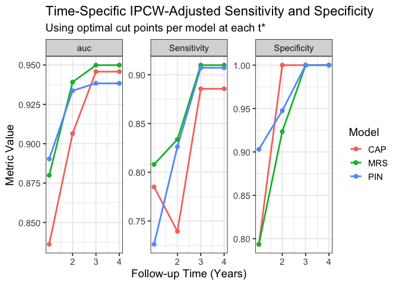

hd_ttd_modeling
================

R code for the manuscript “Adjusting for Heavy Censoring and
Double-Dipping to Compare Risk Stratification Abilities of Existing
Models for Time to Diagnosis of Huntington Disease” by Grosser, Foes,
Li, Parikh, Garcia, and Lotspeich (2025+)

# Data Generation

We can simulate data from a Huntington disease clinical trial in order
to evaluate various models for time to diagnosis. We generate data to
match observations from the ENROLL-HD longitudinal study of Huntington
disease.

``` r
# source("datagen.R")    # build functions for data generation

set.seed(2025)

n = 3000               # sample size
cens.rate = 0.78       # desired censoring rate (approximate)

dat <- data.frame(diag = r_diag(n, cens.rate),
                  age_0 = r_age(n, diag),
                  CAG = r_cag(n, diag),
                  sex = r_sex(n, diag),
                  diagconf = r_dcl(n, diag),
                  motscore = r_tms(n, diag),
                  sdmt1 = r_sdmt(n, diag),
                  swrt1 = r_sword(n, diag),
                  scnt1 = r_scolor(n, diag),
                  sit1 = r_sint(n, diag)
)

dat <- dat %>%
  mutate(motscore2 = motscore^2,
         DCL1 = as.integer(diagconf == 1),
         DCL2 = as.integer(diagconf == 2),
         DCL3 = as.integer(diagconf == 3),
         cagMotscore = CAG*motscore,
         cagAge = CAG*age_0)
design.mat <- model.matrix( ~ 1 + age_0 + sdmt1 + CAG + motscore + motscore2 +
                              cagMotscore + cagAge + swrt1 + scnt1 + sit1 +
                              DCL1 + DCL2 + DCL3, data = dat)

# define parameters for covariates in outcome model
beta <- c(
  `(Intercept)` = -3.2,
  age_0 = 0.02,
  sdmt1 = -0.015,
  CAG = 0.08,
  motscore = 0.03,
  motscore2 = 0.0005,
  cagMotscore = 0.002,
  cagAge = 0.001,
  swrt1 = -0.004,
  scnt1 = -0.003,
  sit1 = -0.005,
  DCL1 = 0.15,
  DCL2 = 0.30,
  DCL3 = 0.50
)

eta <- drop(design.mat %*% beta)

shape <- 1.7 # Weibull shape parameter
scale <- 3   # weibull scale parameter

# generate uniform random variable for inverse transform
U <- runif(n)

# generate event times X using the proportional hazards model
X <- scale * (-log(U) / exp(eta))^(1 / shape)

# generate censoring times
C <- rexp(n = n, rate = cens.rate)

# Observed time and censoring indicator
W <- pmin(ceiling(X), ceiling(C))
delta <- as.numeric(ceiling(X) <= ceiling(C))
sum(delta) 
```

    ## [1] 2658

``` r
# combine survival outcome data and covariates for complete dataset
sim_data <- dat %>%
  mutate(X = X,
         C = C,
         W = W,
         W_age = W + age_0,
         delta = delta,
         CAP = age_0 * (CAG - 34)) %>%
  filter(CAG > 40 & CAG < 57)

head(sim_data)
```

    ##   diag    age_0 CAG    sex diagconf  motscore    sdmt1    swrt1    scnt1
    ## 1    1 48.21408  50   male        1 15.284268 36.97621 98.52859 59.20743
    ## 2    1 49.84176  44   male        3 10.425100 60.40650 57.83964 67.77546
    ## 3    1 54.03482  49 female        3  8.794773 23.10561 38.92302 51.06457
    ## 4    1 53.77018  50 female        3 15.518776 19.47441 59.67254 72.87046
    ## 5    0 30.29905  44 female        3  1.868206 24.98699 85.97723 85.51136
    ## 6    1 43.44430  46 female        2  2.220779 38.42011 84.40090 54.59343
    ##       sit1  motscore2 DCL1 DCL2 DCL3 cagMotscore   cagAge          X          C
    ## 1 34.35674 233.608834    1    0    0   764.21338 2410.704 0.22033424 0.65186168
    ## 2 19.17258 108.682714    0    0    1   458.70441 2193.038 0.08669609 0.14352823
    ## 3 34.03942  77.348038    0    0    1   430.94389 2647.706 0.13292150 0.44934939
    ## 4 48.41397 240.832414    0    0    1   775.93881 2688.509 0.07491362 1.01331141
    ## 5 47.78099   3.490195    0    0    1    82.20108 1333.158 0.35026721 3.89074740
    ## 6 31.89401   4.931860    0    1    0   102.15584 1998.438 0.51559798 0.06976732
    ##   W    W_age delta      CAP
    ## 1 1 49.21408     1 771.4253
    ## 2 1 50.84176     1 498.4176
    ## 3 1 55.03482     1 810.5223
    ## 4 1 54.77018     1 860.3229
    ## 5 1 31.29905     1 302.9905
    ## 6 1 44.44430     1 521.3316

For simplicity, this simulated data set has no missing data other than
censored times of diagnosis.

# Modeling Time to Diagnosis

We can fit all four discussed models for time to diagnosis. The Langbehn
model does not directly model time to diagnosis, but age at diagnosis,
so some wrapper functions are necessary.

``` r
# source("Langbehn_functions.R")    # build functions for Langbehn model

# CAP model: Accelerated failure time model with age at study start and CAG repeat number (and their interaction) as covariates
CAP_model <- survreg(Surv(W, delta) ~ age_0 + CAG:age_0,
                     data = sim_data, dist = "loglogistic")

# MRS model: Cox proportional hazards model with DCL, motor score, Stroop number, Stroop word, Stroop interference, SDMT, CAG repeat number, age at study start as covariates
MRS_model <- coxph(Surv(W, delta) ~ factor(diagconf) + motscore + motscore2 +
                     scnt1 + swrt1 + sit1 + sdmt1 + CAG + age_0 +
                     CAG:motscore + CAG:age_0,
                   data = sim_data, x = TRUE)

# PI model: Cox proportional hazards model with motor score, SDMT, and CAG repeat number age product as covariates 
PI_model <- coxph(Surv(W, delta) ~ motscore + sdmt1 + CAP,
                  data = sim_data, x = TRUE)

# Langbehn model: parametric survival with baseline age and CAG repeat number as covariates
Langbehn_params <- tryCatch(
fit_langbehn_model(sim_data, decay_vals = seq(0.5, 1, by = 0.01)))
```

    ## Best negloglik = 10517.448

# Uno’s C

``` r
# source("Uno-C-functions.R")

# set random seed
set.seed(2025)
n_splits = 5

# create training-testing folds, with stratification by delta to preserve censoring rate
folds <- vfold_cv(sim_data, v = n_splits, strata = delta)

# summarize censoring information for each training and testing split
fold_censoring_summary <- map_dfr(1:n_splits, function(i) {
  test_data <- assessment(folds$splits[[i]])
  event_rate <- mean(test_data$delta == 1)
  tibble(
    fold = i,
    event_rate = event_rate,
    censoring_rate = 1 - event_rate,
    n = nrow(test_data),
    n_events = sum(test_data$delta == 1)
  )
})
print(fold_censoring_summary)
```

    ## # A tibble: 5 × 5
    ##    fold event_rate censoring_rate     n n_events
    ##   <int>      <dbl>          <dbl> <int>    <int>
    ## 1     1      0.922         0.0784   523      482
    ## 2     2      0.898         0.102    522      469
    ## 3     3      0.910         0.0900   522      475
    ## 4     4      0.920         0.0805   522      480
    ## 5     5      0.902         0.0977   522      471

``` r
# preallocate output for models
fitted_models_by_fold <- vector("list", length = n_splits)

for (i in 1:n_splits) {
  # training-testing split i
  split <- folds$splits[[i]]
  
  # training set i
  train_data <- analysis(split)
  
  # testing set i
  test_data  <- assessment(split)

  # CAP model
  CAP_model <- survreg(Surv(W, delta) ~ age_0 + CAG:age_0,
                       data = train_data, dist = "loglogistic")

  # MRS model
  MRS_model <- coxph(Surv(W, delta) ~ factor(diagconf) +
                       motscore + motscore2 +
                       scnt1 + swrt1 + sit1 + sdmt1 + CAG + age_0 +
                       CAG:motscore + CAG:age_0,
                     data = train_data, x = TRUE)

  # PI model
  PI_model <- coxph(Surv(W, delta) ~ motscore + sdmt1 + CAP,
                    data = train_data, x = TRUE)

  Langbehn_params <- tryCatch(
  fit_langbehn_model(train_data, decay_vals = seq(0.5, 1, by = 0.01)),
  error = function(e) {
    message(paste("Langbehn fit failed on fold", i, ":", e$message))
    return(NULL)
    }
  )

  # Linear predictors (negate for AFT to maintain directionality)
  lp_CAP <- -predict(CAP_model, newdata = test_data, type = "lp")
  lp_MRS <-  predict(MRS_model, newdata = test_data, type = "lp")
  lp_PI  <-  predict(PI_model,  newdata = test_data, type = "lp")
  
  # Langbehn-based risk score (CDF of diagnosis in next 5 years)
  risk_Langbehn <- Langbehn_cond_CDF(Langbehn_params,
                                     current_age = test_data$age_0,
                                     time_to_diag = 5,
                                     cag = test_data$CAG)
  
  # Store models, linear predictors, and training and testing data
  fitted_models_by_fold[[i]] <- list(
    CAP = CAP_model,
    MRS = MRS_model,
    PI = PI_model,
    Langbehn = Langbehn_params,
    lp_CAP = lp_CAP,
    lp_MRS = lp_MRS,
    lp_PI  = lp_PI,
    lp_Langbehn = risk_Langbehn,
    train_data = train_data,
    test_data = test_data
  )
}
```

    ## Best negloglik = 8363.695
    ## Best negloglik = 8464.994
    ## Best negloglik = 8401.132
    ## Best negloglik = 8390.775
    ## Best negloglik = 8448.324

``` r
# Extract Langbehn parameter estimates across folds
langbehn_params_all <- map(fitted_models_by_fold, ~ .x$Langbehn) %>%
  do.call(rbind, .) %>%
  as.data.frame()

# Name the parameters for clarity
colnames(langbehn_params_all) <- c("mu_intercept", "mu_scale", "mu_decay",
                                   "sigma_intercept", "sigma_scale", "sigma_decay")

# Show the parameter estimates across folds
# print(langbehn_params_all)

custom_uno_results <- map_dfr(1:5, function(fold_idx) {
  models <- fitted_models_by_fold[[fold_idx]]
  train_data <- models$train_data
  test_data  <- models$test_data

  # Fit KM for censoring distribution from training data
  km_cens <- survfit(Surv(W, 1 - delta) ~ 1, data = train_data)
  G_hat_left <- function(t) {
    s <- summary(km_cens, times = unique(c(0, km_cens$time)), extend = TRUE)
    approx(
      x = s$time,
      y = s$surv,
      xout = t - 1e-8,
      method = "constant",
      f = 0,
      rule = 2
    )$y
  }

  # Prepare output across models and t_star
  bind_rows(
    tibble(model = "Langbehn", lp = models$lp_Langbehn),
    tibble(model = "CAP", lp = models$lp_CAP),
    tibble(model = "MRS", lp = models$lp_MRS),
    tibble(model = "PIN", lp = models$lp_PI)
  ) %>%
    mutate(fold = fold_idx) %>%
    group_by(model, fold) %>%
    group_modify(~ {
      test_data$lp <- .x$lp
      map_dfr(1:2, function(t_star) {
        tibble(
          time = t_star,
          uno_c_custom = compute_uno_c(test_data, G_hat_left, t_star)
        )
      })
    })
})
# display Uno's C results from custom function
head(custom_uno_results)
```

    ## # A tibble: 6 × 4
    ## # Groups:   model, fold [3]
    ##   model     fold  time uno_c_custom
    ##   <chr>    <int> <int>        <dbl>
    ## 1 CAP          1     1        0.829
    ## 2 CAP          1     2        0.828
    ## 3 Langbehn     1     1        0.801
    ## 4 Langbehn     1     2        0.800
    ## 5 MRS          1     1        0.909
    ## 6 MRS          1     2        0.908

``` r
# create event weights for global Uno's C values across times by fold
event_weights <- map_dfr(1:5, function(fold_idx) {
  train_data <- fitted_models_by_fold[[fold_idx]]$train_data

  # Event counts at each t* in training data
  weights <- map_dbl(1:2, function(t) {
    sum(train_data$W == t & train_data$delta == 1)
  })
  weights <- weights / sum(weights)

  tibble(
    fold = fold_idx,
    time = 1:2,
    weight = weights
  )
})

# summarize Uno's C global values and combine with time-specific data
global_iAUC <- custom_uno_results %>%
  filter(!is.na(time)) %>%
  left_join(event_weights, by = c("fold", "time")) %>%
  group_by(fold, model) %>%
  summarize(
    time = NA_integer_,
    uno_c_custom = weighted.mean(uno_c_custom, weight, na.rm = TRUE),
    .groups = "drop"
  )

head(custom_uno_results <- bind_rows(custom_uno_results, global_iAUC))
```

    ## # A tibble: 6 × 4
    ## # Groups:   model, fold [3]
    ##   model     fold  time uno_c_custom
    ##   <chr>    <int> <int>        <dbl>
    ## 1 CAP          1     1        0.829
    ## 2 CAP          1     2        0.828
    ## 3 Langbehn     1     1        0.801
    ## 4 Langbehn     1     2        0.800
    ## 5 MRS          1     1        0.909
    ## 6 MRS          1     2        0.908

# ROC

``` r
CV_ROC_results <- map_dfr(1:5, function(i) {
  models    <- fitted_models_by_fold[[i]]
  test_data <- models$test_data

  markers <- list(
    Langbehn = models$lp_Langbehn,
    CAP = models$lp_CAP,
    MRS = models$lp_MRS,
    PIN = models$lp_PI
  )

  # For each model and predict_time, compute AUC
  map_dfr(names(markers), function(model_name) {
    marker_vec <- markers[[model_name]]

    map_dfr(1:2, function(t_star) {
      auc_val <- 
          survivalROC(
            Stime        = test_data$W,
            status       = test_data$delta,
            marker       = marker_vec,
            predict.time = t_star,
            method       = "KM"
          )$AUC
      tibble(
        fold         = i,
        model        = model_name,
        predict_time = t_star,
        AUC          = auc_val
      )
    })
  })
})

head(CV_ROC_results)
```

    ## # A tibble: 6 × 4
    ##    fold model    predict_time   AUC
    ##   <int> <chr>           <int> <dbl>
    ## 1     1 Langbehn            1 0.801
    ## 2     1 Langbehn            2 0.893
    ## 3     1 CAP                 1 0.827
    ## 4     1 CAP                 2 0.933
    ## 5     1 MRS                 1 0.906
    ## 6     1 MRS                 2 0.972

# Sample Enrichment

``` r
#source("sample-enrichment-functions.R")

# Compute risk scores for CAP, PIN, and MRS models with published parameters
sim_data <- sim_data %>%
  mutate(
    # Published parameter estimates
    risk_CAP = age_0 * (CAG - 33.66),
    risk_MRS = -0.282 * age_0 + 0.140 * CAG + 0.565 * motscore - 0.021 * sdmt1 +
      0.347 * if_else(diagconf == 1, 1, 0) + 0.542 * if_else(diagconf == 2, 1, 0) +
      1.086 * if_else(diagconf == 3, 1, 0) - 0.004 * scnt1 +
      0.002 * swrt1 - 0.023 * sit1 - 0.004 * motscore^2 -
      0.010 * motscore * CAG + 0.009 * age_0 * CAG,
    risk_PIN = (51 * motscore - 34 * sdmt1 + 7 * (age_0 * (CAG - 33.66)) - 883) / 1044
  )

# Compute optimal ROC threshold per model at each time point
roc_thresholds <- map_dfr(1:4, function(t) {
  bind_cols(
    run_survivalROC(sim_data, t, "risk_CAP")  %>% rename_with(~ paste0("CAP_", .), -time),
    run_survivalROC(sim_data, t, "risk_MRS")  %>% select(-time) %>% rename_with(~ paste0("MRS_", .)),
    run_survivalROC(sim_data, t, "risk_PIN")  %>% select(-time) %>% rename_with(~ paste0("PIN_", .))
  )
})

# View results
print(roc_thresholds)
```

    ## # A tibble: 4 × 13
    ##    time CAP_cut CAP_sens CAP_spec CAP_auc MRS_cut MRS_sens MRS_spec MRS_auc
    ##   <int>   <dbl>    <dbl>    <dbl>   <dbl>   <dbl>    <dbl>    <dbl>   <dbl>
    ## 1     1    337.    0.785    0.794   0.836    9.22    0.808    0.794   0.880
    ## 2     2    326.    0.739    1       0.906    8.66    0.834    0.923   0.939
    ## 3     3    274.    0.886    1       0.946    7.44    0.910    1       0.950
    ## 4     4    274.    0.886    1       0.946    7.44    0.910    1       0.950
    ## # ℹ 4 more variables: PIN_cut <dbl>, PIN_sens <dbl>, PIN_spec <dbl>,
    ## #   PIN_auc <dbl>

``` r
# Convert results to long format
long_roc_data <- roc_thresholds %>%
  pivot_longer(cols = -time,
               names_to = c("model", "metric"),
               names_sep = "_",
               values_to = "value") %>%
  mutate(
    model = factor(model, levels = c("CAP", "MRS", "PIN")),
    metric = recode(metric, sens = "Sensitivity", spec = "Specificity")
  ) %>%
  filter(metric != "cut")

# Plot sensitivity and specificity over time
ggplot(long_roc_data, aes(x = time, y = value, color = model)) +
  geom_line(size = 1) +
  geom_point(size = 2) +
  facet_wrap(~ metric, scales = "free_y") +
  scale_x_continuous(breaks = 2:5) +
  labs(x = "Follow-up Time (Years)",
       y = "Metric Value",
       color = "Model",
       title = "Time-Specific IPCW-Adjusted Sensitivity and Specificity",
       subtitle = "Using optimal cut points per model at each t*") +
  theme_bw(base_size = 14)
```

    ## Warning: Using `size` aesthetic for lines was deprecated in ggplot2 3.4.0.
    ## ℹ Please use `linewidth` instead.
    ## This warning is displayed once every 8 hours.
    ## Call `lifecycle::last_lifecycle_warnings()` to see where this warning was
    ## generated.

<!-- -->

``` r
# Define the sample size formula (per arm)
# Prepare to store results
enrichment_summary <- expand.grid(
  time = 2:4,
  model = c("CAP", "MRS", "PIN"),
  reduction = c(0.3, 0.4, 0.5),
  stringsAsFactors = FALSE
) %>%
  mutate(event_rate = NA_real_, sample_size = NA_integer_)

# Loop over model-time combinations
for (i in seq_len(nrow(enrichment_summary))) {
  row <- enrichment_summary[i, ]
  t_star <- row$time
  model <- row$model
  reduction <- row$reduction
  
  # Get cut point for this model and time from your ROC results
  cut_column <- paste0(model, "_cut")
  cut_point <- roc_thresholds %>%
    filter(time == t_star) %>%
    pull(!!sym(cut_column))
  
  # Risk score column name
  risk_column <- paste0("risk_", model)
  
  # Define enriched group: patients above threshold
  enriched <- sim_data %>%
    filter(!!sym(risk_column) >= cut_point)
  
  # Estimate event rate by t_star in enriched group
  event_rate <- mean(enriched$W <= t_star & enriched$delta == 1)
  
  # Store
  enrichment_summary$event_rate[i] <- event_rate
  enrichment_summary$sample_size[i] <- sample_size_binary(p1 = event_rate, effect_size = reduction)
}

# Optional: reshape wide for easier table export
summary_wide <- enrichment_summary %>%
  pivot_wider(id_cols = c(time, model, event_rate),
              names_from = reduction,
              names_prefix = "n_",
              values_from = sample_size)

print(summary_wide, n = 12)
```

    ## # A tibble: 9 × 6
    ##    time model event_rate n_0.3 n_0.4 n_0.5
    ##   <int> <chr>      <dbl> <dbl> <dbl> <dbl>
    ## 1     2 CAP        0.972    27    18    14
    ## 2     3 CAP        0.927    34    22    16
    ## 3     4 CAP        0.927    34    22    16
    ## 4     2 MRS        0.962    29    19    14
    ## 5     3 MRS        0.938    33    21    15
    ## 6     4 MRS        0.938    33    21    15
    ## 7     2 PIN        0.964    28    19    14
    ## 8     3 PIN        0.940    32    21    15
    ## 9     4 PIN        0.940    32    21    15

``` r
# Get cut-points in long format
cut_long <- roc_thresholds %>%
  select(time, CAP_cut, MRS_cut, PIN_cut) %>%
  pivot_longer(cols = -time,
               names_to = "model",
               values_to = "cut_point") %>%
  mutate(model = str_remove(model, "_cut"))

# Round final results
summary_wide_with_cut <- summary_wide %>%
  left_join(cut_long, by = c("time", "model")) %>%
  mutate(across(starts_with("n_"), round),
         event_rate = round(event_rate, 3),
         cut_point = round(cut_point, 2)) %>%
  select(time, model, cut_point, event_rate, starts_with("n_"))
```
